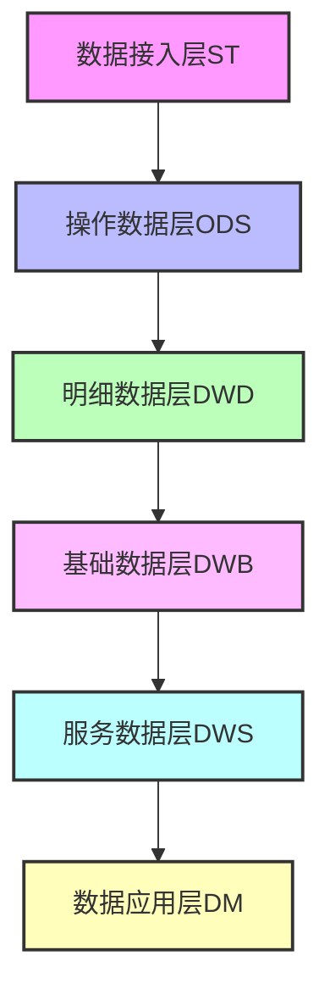
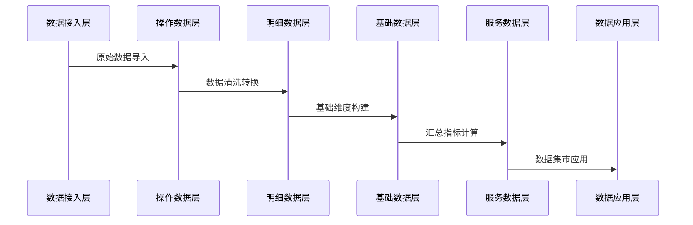

# PKu2024_bigData 数据仓库项目

[English](README_EN.md) | 简体中文

## 作者声明

2024级北京大学大数据课程项目组成员：
- 石卓凡
- 蒋云涛
- 赵翊含
- 郭晓爽

## 项目简介
本项目是北京大学2024年大数据课程的实践项目，实现了一个完整的数据仓库解决方案。项目采用分层架构设计，涵盖了从数据接入层(ST)到数据应用层(DM)的端到端数据处理流程，支持自动化的数据采集、转换和加载过程。

## 技术栈
- 编程语言：Python 3.8+
- 数据库：Oracle、Hive
- 大数据处理：Spark
- 容器化：Docker & Docker Compose
- 其他：HDFS、SASL

## 项目特点
- 完整的数据仓库分层架构（ST -> ODS -> DWD -> DWB -> DWS -> DM）
- 自动化的数据处理流程
- 灵活的配置管理系统
- 完善的日志记录机制
- 支持Docker容器化部署
- 多维度数据分析能力
- 高可扩展性设计

## 项目结构
```
PKu2024_bigData/
├── auto_create_hive_table/    # 核心功能模块
│   ├── cn/                    # 主代码目录
│   │   └── pku/
│   │       ├── datatohive/   # 数据处理相关类
│   │       └── utils/        # 工具类
│   ├── config/               # 配置文件目录
│   │   ├── settings.py      # 主配置文件
│   │   └── common.py        # 通用配置
│   ├── log/                 # 日志目录
│   └── resources/           # 资源文件
├── dw/                      # 数据仓库主目录
│   ├── st/                  # 数据接入层
│   ├── ods/                 # 操作数据层
│   ├── dwd/                 # 明细数据层
│   ├── dwb/                 # 基础数据层
│   ├── dws/                 # 服务数据层
│   └── dm/                  # 数据应用层
├── docker/                  # Docker相关文件
├── tests/                   # 测试用例
└── docs/                   # 项目文档

## 系统架构


## 数据流程


## 环境要求

### 系统要求
- Linux/Windows/MacOS
- 8GB+ RAM
- 50GB+ 可用磁盘空间

### 软件依赖
- Python 3.8+
- Oracle 客户端
- Hive 2.x+
- Spark 2.x+
- Docker 20.10+
- Docker Compose 2.x+

## 快速开始

### 方法一：本地部署

1. 克隆项目
```bash
git clone https://github.com/your-repo/PKu2024_bigData.git
cd PKu2024_bigData
```

2. 安装依赖
```bash
pip install -r requirements.txt
```

3. 配置数据库连接
编辑 `auto_create_hive_table/resources/config.txt`

4. 运行程序
```bash
python auto_create_hive_table/cn/pku/EntranceApp.py
```

### 方法二：Docker部署

1. 构建并启动容器
```bash
chmod +x docker-run.sh
./docker-run.sh
```

2. 查看运行状态
```bash
docker-compose ps
```

## 配置说明

### 数据库配置
在 `config.txt` 中配置以下信息：
- Oracle 连接参数
- Hive 连接参数
- Spark 配置参数

### 日志配置
- 日志级别：DEBUG/INFO/WARN/ERROR
- 输出方式：控制台/文件
- 轮转策略：大小/时间
- 保留策略：数量/天数

## 开发指南

### 代码规范
- 遵循PEP 8规范
- 使用类型注解
- 编写单元测试
- 添加详细注释

### 分支管理
- main: 主分支
- develop: 开发分支
- feature/*: 功能分支
- hotfix/*: 修复分支

## 测试

### 单元测试
```bash
python -m pytest tests/
```

### 集成测试
```bash
python -m pytest tests/integration/
```

## 部署

### 生产环境部署步骤
1. 准备环境
2. 配置参数
3. 部署服务
4. 验证运行

### 监控和维护
- 日志监控
- 性能监控
- 错误告警
- 定期备份

## 常见问题

### 数据库连接问题
- 检查网络连接
- 验证账号权限
- 确认服务状态

### Docker相关问题
- 检查Docker服务
- 确认端口占用
- 查看容器日志

## 版本历史

### v1.0.0 (2024-01-01)
- 初始版本发布
- 基础功能实现

### v1.1.0 (2024-02-01)
- 添加Docker支持
- 优化性能
- 修复已知问题

## 贡献指南
1. Fork 项目
2. 创建功能分支
3. 提交变更
4. 发起Pull Request

## 许可证
MIT License

## 联系方式
- 项目负责人：XXX
- 邮箱：xxx@xxx.com
- 项目主页：https://github.com/xxx/PKu2024_bigData

## 致谢
感谢所有为本项目做出贡献的同学和老师。