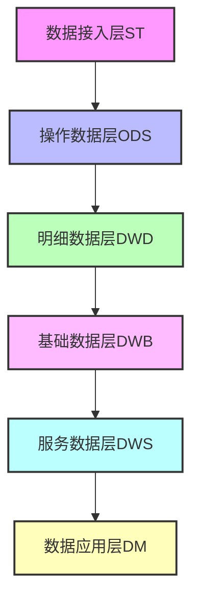
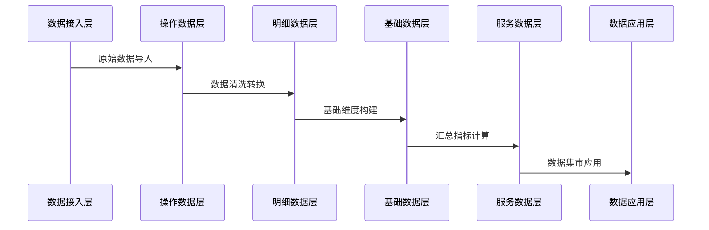

# PKu2024_bigData 数据仓库项目

## 作者声明

2024级

石卓凡 蒋云涛  赵翊含 郭晓爽

## 项目简介
本项目隶属于北京大学2024年大数据课程项目，是一个数据仓库项目，主要用于自动化创建Hive表并进行数据处理。项目采用分层架构设计，包含从数据接入层(ST)到数据应用层(DM)的完整数据处理流程。

## 项目结构
```
PKu2024_bigData/
├── auto_create_hive_table/    # 自动创建Hive表核心功能
│   ├── config/               # 配置文件目录
│   │   ├── settings.py      # 主配置文件
│   │   └── common.py        # 通用配置
│   ├── cn/                  # 核心代码
│   ├── log/                 # 日志目录
│   └── resources/           # 资源文件
├── dw/                      # 数据仓库主目录
│   ├── st/                  # 数据接入层
│   ├── ods/                 # 操作数据层
│   ├── dwd/                 # 明细数据层
│   ├── dwb/                 # 基础数据层
│   ├── dws/                 # 服务数据层
│   └── dm/                  # 数据应用层
└── venv/                    # Python虚拟环境
```

## 数据仓库架构


## 功能特点
1. 自动化Hive表创建
2. 完整的数据仓库分层架构
3. 灵活的配置管理
4. 详细的日志记录

## 配置说明
- 日志配置：支持控制台和文件两种输出方式
- 日志轮转：单个日志文件最大5M，最多保留5个备份
- 日志格式：支持标准、简单、测试三种格式

## 使用说明
1. 确保已安装Python环境
3. 安装依赖包
4. 配置相关参数
5. 运行程序

## 数据流程


## 添加Docker相关说明

本项目是一个基于 Python 的数据仓库项目，实现了从 ODS 到 DWD、DWS、DM 和 ST 层的数据处理流程。

## 项目结构

```
OneMake30/
├── auto_create_hive_table/    # 主要代码目录
│   ├── cn/
│   │   └── pku/
│   │       ├── datatohive/    # 数据处理相关类
│   │       └── utils/         # 工具类
│   ├── config/                # 配置文件
│   └── resources/             # 资源文件
├── dw/                        # 数据仓库相关文件
│   ├── ods/                   # ODS层配置
│   ├── dwd/                   # DWD层配置
│   └── st/                    # ST层配置
└── logs/                      # 日志文件
```

## 环境要求

- Python 3.8+
- Oracle 客户端
- Hive 环境
- Spark 环境
- Docker (可选)

## 配置说明

1. 在 `auto_create_hive_table/resources/config.txt` 中配置数据库连接信息：
   - Oracle 连接信息
   - Hive 连接信息
   - Spark 连接信息

2. 确保 `dw/ods/meta_data/tablenames.txt` 包含了需要处理的表名列表

## 使用方法

### 方法一：直接运行

1. 安装依赖：
```bash
pip install -r requirements.txt
```

2. 运行主程序：
```bash
python auto_create_hive_table/cn/pku/EntranceApp.py
```

### 方法二：Docker 部署

本项目支持使用 Docker 进行部署，提供了完整的容器化支持。

#### 前置要求

- 安装 Docker：[Docker 安装指南](https://docs.docker.com/get-docker/)
- 安装 Docker Compose：[Docker Compose 安装指南](https://docs.docker.com/compose/install/)

#### Docker 部署步骤

1. **准备配置文件**

确保以下配置文件已正确设置：
- `auto_create_hive_table/resources/config.txt`：数据库连接配置
- `dw/ods/meta_data/tablenames.txt`：表名列表

2. **构建和运行容器**

方法 1：使用脚本（推荐）
```bash
# 添加执行权限
chmod +x docker-run.sh

# 运行脚本
./docker-run.sh
```

方法 2：手动执行
```bash
# 构建镜像
docker-compose build

# 启动服务
docker-compose up -d

# 查看日志
docker-compose logs -f
```

3. **停止服务**
```bash
docker-compose down
```

#### Docker 目录映射

Docker 配置中包含以下目录映射：
- `./auto_create_hive_table:/app/auto_create_hive_table`：代码和配置文件
- `./dw:/app/dw`：数据仓库文件
- `./logs:/app/logs`：日志文件

#### 环境变量

Docker 环境中已配置以下环境变量：
- `ORACLE_HOME=/usr/lib/oracle/client`
- `LD_LIBRARY_PATH=/usr/lib/oracle/client`
- `TNS_ADMIN=/app/auto_create_hive_table/resources`

#### 注意事项

1. 确保 Docker 容器能够访问：
   - Oracle 数据库
   - Hive 服务
   - HDFS 服务

2. 如果修改了配置文件，需要重新构建镜像：
```bash
docker-compose build --no-cache
```

3. 查看容器状态：
```bash
docker-compose ps
```

4. 查看容器日志：
```bash
docker-compose logs -f
```

5. 进入容器调试：
```bash
docker-compose exec pkubigdata bash
```

## 故障排除

1. 如果遇到数据库连接问题：
   - 检查 config.txt 中的连接配置
   - 确保网络连接正常
   - 检查相关服务是否启动

2. 如果遇到权限问题：
   - 检查用户权限设置
   - 确保日志目录可写

3. 如果遇到 Docker 相关问题：
   - 检查 Docker 服务状态
   - 查看容器日志
   - 确保端口未被占用

## 维护和更新

1. 更新代码后重新构建：
```bash
git pull
docker-compose build --no-cache
docker-compose up -d
```

2. 清理 Docker 资源：
```bash
# 停止并删除容器
docker-compose down

# 清理未使用的镜像
docker image prune -f
```