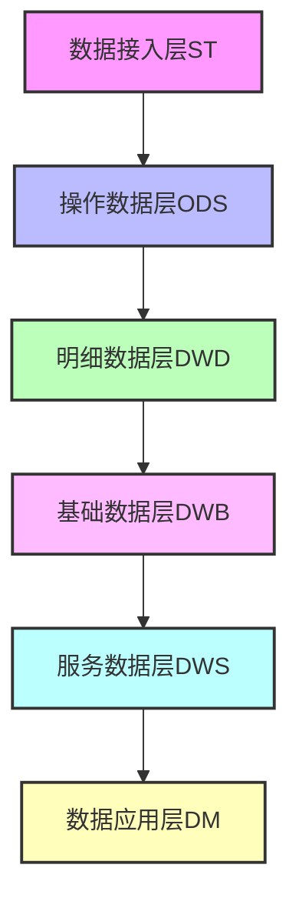
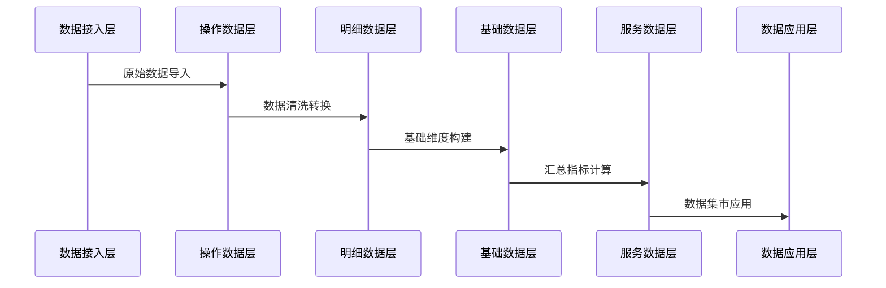

# PKu2024_bigData 数据仓库项目

## 项目简介
一个数据仓库项目，主要用于自动化创建Hive表并进行数据处理。项目采用分层架构设计，包含从数据接入层(ST)到数据应用层(DM)的完整数据处理流程。

## 项目结构
```
PKu2024_bigData/
├── auto_create_hive_table/    # 自动创建Hive表核心功能
│   ├── config/               # 配置文件目录
│   │   ├── settings.py      # 主配置文件
│   │   └── common.py        # 通用配置
│   ├── cn/                  # 核心代码
│   ├── log/                 # 日志目录
│   └── resources/           # 资源文件
├── dw/                      # 数据仓库主目录
│   ├── st/                  # 数据接入层
│   ├── ods/                 # 操作数据层
│   ├── dwd/                 # 明细数据层
│   ├── dwb/                 # 基础数据层
│   ├── dws/                 # 服务数据层
│   └── dm/                  # 数据应用层
└── venv/                    # Python虚拟环境
```

## 数据仓���架构


## 功能特点
1. 自动化Hive表创建
2. 完整的数据仓库分层架构
3. 灵活的配置管理
4. 详细的日志记录

## 配置说明
- 日志配置：支持控制台和文件两种输出方式
- 日志轮转：单个日志文件最大5M，最多保留5个备份
- 日志格式：支持标准、简单、测试三种格式

## 使用说明
1. 确保已安装Python环境
2. 激活虚拟环境：
```bash
source venv/bin/activate  # Linux/Mac
venv\Scripts\activate     # Windows
```
3. 安装依赖包
4. 配置相关参数
5. 运行程序

## 数据流程
