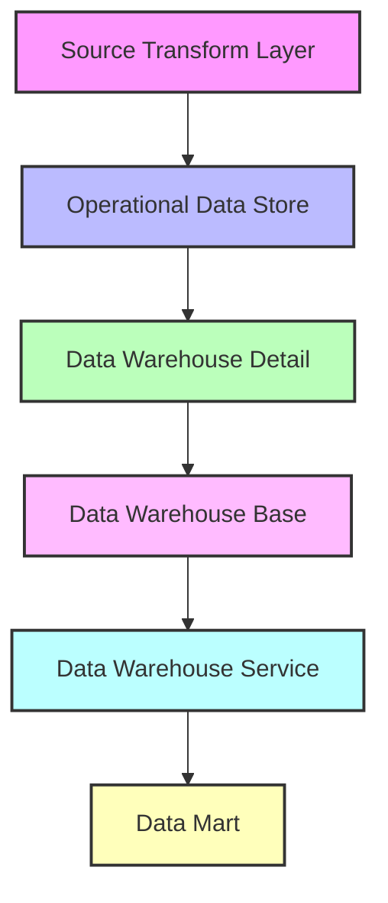
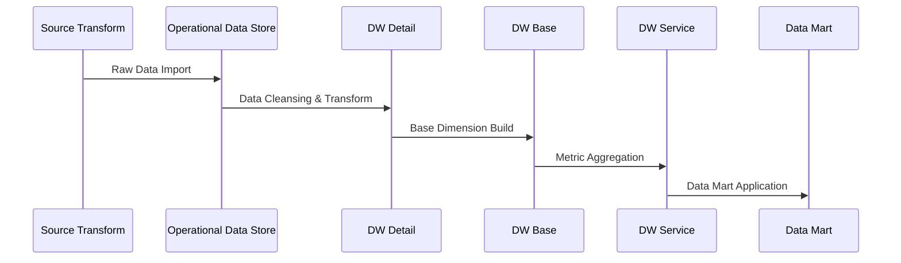

# PKu2024_bigData Data Warehouse Project

English | [简体中文](README.md)

## Authors

2024 Peking University Big Data Course Project Team Members:
- Zhuofan Shi
- Yuntao Jiang
- Yihan Zhao
- Xiaoshuang Guo

## Project Overview
This project is a practical implementation for the 2024 Big Data Course at Peking University, delivering a comprehensive data warehouse solution. The project adopts a layered architecture design, covering end-to-end data processing from the Source Transform (ST) layer to the Data Mart (DM) layer, supporting automated data collection, transformation, and loading processes.

## Technology Stack
- Programming Language: Python 3.8+
- Databases: Oracle, Hive
- Big Data Processing: Spark
- Containerization: Docker & Docker Compose
- Others: HDFS, SASL

## Key Features
- Complete data warehouse layered architecture (ST -> ODS -> DWD -> DWB -> DWS -> DM)
- Automated data processing workflow
- Flexible configuration management system
- Comprehensive logging mechanism
- Docker containerization support
- Multi-dimensional data analysis capabilities
- Highly scalable design

## Project Structure
```
PKu2024_bigData/
├── auto_create_hive_table/    # Core functionality module
│   ├── cn/                    # Main code directory
│   │   └── pku/
│   │       ├── datatohive/   # Data processing classes
│   │       └── utils/        # Utility classes
│   │   ├── config/               # Configuration directory
│   │   │   ├── settings.py      # Main configuration
│   │   │   └── common.py        # Common settings
│   │   ├── log/                 # Log directory
│   │   └── resources/           # Resource files
│   ├── dw/                      # Data warehouse main directory
│   │   ├── st/                  # Source Transform layer
│   │   ├── ods/                 # Operational Data Store layer
│   │   ├── dwd/                 # Data Warehouse Detail layer
│   │   ├── dwb/                 # Data Warehouse Base layer
│   │   ├── dws/                 # Data Warehouse Service layer
│   │   └── dm/                  # Data Mart layer
│   ├── docker/                  # Docker-related files
│   ├── tests/                   # Test cases
│   └── docs/                    # Project documentation
```

## System Architecture


## Data Flow


## Requirements

### System Requirements
- Linux/Windows/MacOS
- 8GB+ RAM
- 50GB+ Available Disk Space

### Software Dependencies
- Python 3.8+
- Oracle Client
- Hive 2.x+
- Spark 2.x+
- Docker 20.10+
- Docker Compose 2.x+

## Quick Start

### Method 1: Local Deployment

1. Clone the project
```bash
git clone https://github.com/your-repo/PKu2024_bigData.git
cd PKu2024_bigData
```

2. Install dependencies
```bash
pip install -r requirements.txt
```

3. Configure database connection
Edit `auto_create_hive_table/resources/config.txt`

4. Run the program
```bash
python auto_create_hive_table/cn/pku/EntranceApp.py
```

### Method 2: Docker Deployment

1. Build and start container
```bash
chmod +x docker-run.sh
./docker-run.sh
```

2. Check running status
```bash
docker-compose ps
```

## Configuration

### Database Configuration
Configure the following in `config.txt`:
- Oracle connection parameters
- Hive connection parameters
- Spark configuration parameters

### Logging Configuration
- Log levels: DEBUG/INFO/WARN/ERROR
- Output methods: Console/File
- Rotation strategy: Size/Time
- Retention policy: Count/Days

## Development Guide

### Code Standards
- Follow PEP 8 guidelines
- Use type annotations
- Write unit tests
- Add detailed comments

### Branch Management
- main: Main branch
- develop: Development branch
- feature/*: Feature branches
- hotfix/*: Hotfix branches

## Testing

### Unit Testing
```bash
python -m pytest tests/
```

### Integration Testing
```bash
python -m pytest tests/integration/
```

## Deployment

### Production Deployment Steps
1. Prepare environment
2. Configure parameters
3. Deploy services
4. Verify operation

### Monitoring and Maintenance
- Log monitoring
- Performance monitoring
- Error alerting
- Regular backups

## Common Issues

### Database Connection Issues
- Check network connectivity
- Verify account permissions
- Confirm service status

### Docker-related Issues
- Check Docker service
- Verify port availability
- View container logs

## Version History

### v1.0.0 (2024-01-01)
- Initial release
- Basic functionality implementation

### v1.1.0 (2024-02-01)
- Added Docker support
- Performance optimization
- Bug fixes

## Contributing
1. Fork the project
2. Create a feature branch
3. Submit changes
4. Create Pull Request

## License
MIT License

## Contact
- Project Lead: XXX
- Email: xxx@xxx.com
- Project Homepage: https://github.com/xxx/PKu2024_bigData

## Acknowledgments
Thanks to all students and teachers who contributed to this project. 